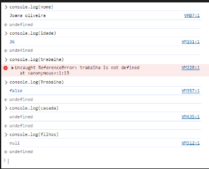
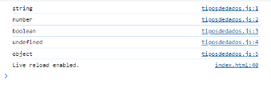
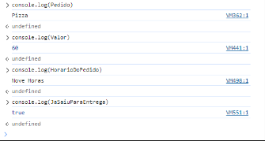
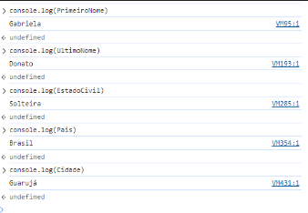
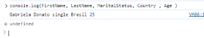
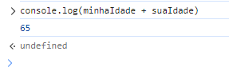

# 💻 Dia 1: Exercícios

1. Escreva um comentário de linha única que diga, _comentários faz seu código ser fácil de ler_
2. Escreva outro comentário de linha única que diga, _Welcome to 30DaysOfJavaScript_
3. Escreva um comentário de várias linhas que diga, _comentários faz seu código ser fácil de ler, fácil de reusar_ _e informátivo_
4. Crie um  arquivo variavel.js e declare variáveis e atribua uma string, boolean, undefined e null 
5. Crie um arquivo tiposdedados.js e use o JavaScript **_typeof_** operador para verificar diferentes tipos de dados. Verifique o tipo de dado de cada variável
6. Declare quatro variáveis sem atribuir valores
7. Declare quatro variáveis e atribuir valores 
8. Declare variáveis para armazenar seu primeiro nome, ultimo nome, estado civil, país e idade em multiplas linhas 
9. Declare variáveis para armazenar seu primeiro nome, ultimo nome, estado civil, país e idade em uma única linha
10. Declare duas variáveis _minhaIdade_ e _suaIdade_ e atribua valores iniciais e mostre no console do navegador.

## Resultados no devtools

### Variaveis
4. Crie um  arquivo variavel.js e declare variáveis e atribua uma string, boolean, undefined e null 

### Tipos de dados 

5. Crie um arquivo tiposdedados.js e use o JavaScript **_typeof_** operador para verificar diferentes tipos de dados. Verifique o tipo de dado de cada variável

### Declare 

7. Declare quatro variáveis e atribuir valores 

 

8. Declare variáveis para armazenar seu primeiro nome, ultimo nome, estado civil, país e idade em multiplas linhas 

9. Declare variáveis para armazenar seu primeiro nome, ultimo nome, estado civil, país e idade em uma única linha

10. Declare duas variáveis _minhaIdade_ e _suaIdade_ e atribua valores iniciais e mostre no console do navegador.

