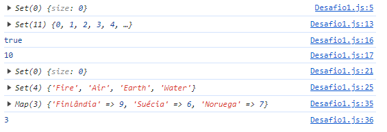
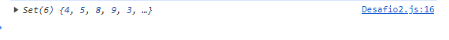
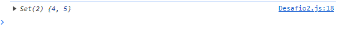
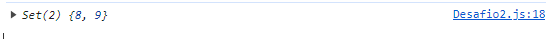

## Exercícios 💻

### Exercícios: Nível 1

```js
const a = [4, 5, 8, 9]
const b = [3, 4, 5, 7]
const countries = ['Finlândia', 'Suécia', 'Noruega']
```

1. Crie um conjunto vazio.
2. Crie um conjunto contendo os números de 0 a 10 usando um loop.
3. Remova um elemento de um conjunto.
4. Limpe um conjunto.
5. Crie um conjunto com 5 elementos de string a partir de um array.
6. Crie um mapa de países e o número de caracteres de cada país.



### Exercícios: Nível 2

1. Encontre a união de a e b.



2. Encontre a interseção de a e b.



3. Encontre a diferença de a em relação a b.



### Exercícios: Nível 3

1. Quantas línguas existem no arquivo de dados dos países.

2. **Use os dados dos países para encontrar as 10 línguas mais faladas:**

```js
   // Sua saída deve ser assim
   console.log(mostSpokenLanguages(countries, 10))
   [
     { Inglês: 91 },
     { Francês: 45 },
     { Árabe: 25 },
     { Espanhol: 24 },
     { Russo: 9 },
     { Português: 9 },
     { Holandês: 8 },
     { Alemão: 7 },
     { Chinês: 5 },
     { Suaíli: 4 },
     { Sérvio: 4 }
   ]

  // Sua saída deve ser assim
  console.log(mostSpokenLanguages(countries, 3))
  [
  {Inglês:91},
  {Francês:45},
  {Árabe:25}
  ]
```