## 💻 Dia 2: Exercícios

### Exercícios: Level 1

1. Declare uma variável chamada desafio e atribua a ela um valor inicial **'30 Dias de JavaScript'**. 
2. Imprimir uma string no console do browser usando __console.log()__ .
3. Imprimir o __length__ da string no console do browser usando o __console.log()__.
4. Troque todos os caracteres da string para letras maiúsculas usando o método __toUpperCase()__.
5. Troque todos os caracteres da string para letras minúsculas usando o método __toLowerCase()__.
6. Retirar (Slice) a primeira letra da string usando os métodos __substr()__ ou __substring()__. 
7. Dividir a frase *Days Of JavaScript* de *30 Days Of JavaScript*.
8. Verificar se a string contém a palavra __Script__ usando o método __includes()__.
9. Separar a __string__ em um __array__ usando o método __split()__.
10. Separar a string 30 Dias de JavaScript com espaços usando o método __split()__.
11. "Facebook, Google, Microsoft, Apple, IBM, Oracle, Amazon" __split__ a string com vírgulas e mude-a para um array. 
12. Mude 30 Dias de JavaScript para 30 Dias de Python usando o método __replace()__.
13. Qual é o caractere no index 15 em "30 Dias de JavaScript' string? Use o método __charAt()__.
14. Qual é o código do caractere de J em "30 Dias de JavaScript" string usando o método __charCodeAt()__.
15. Use __indexOf__ para determinar a posição da primeira ocorrência de __a__ em 30 Dias de JavaScript.
16. Use __lastIndexOf__ para determinar a posição da última ocorrência de __a__ em 30 Dias de JavaScript.
17. Use __indexOf__ para encontrar a posição da primeira ocorrência da palavra __because__ na seguinte frase:__'You cannot end a sentence with because because because is a conjunction'__.
18. Use __lastIndexOf__ para encontrar a posição da última ocorrência da palavra __because__ na seguinte frase:__'You cannot end a sentence with because because because is a conjunction'__.
19. Use __search__ para encontrar a posição da primeira ocorrência da palavra __because__ na seguinte frase:__'You cannot end a sentence with because because because is a conjunction'__.
20. Use __trim()__ para remover qualquer espaço adicional no início e no final da string .E.g "   30 Dias de JavaScript   ".
21. Use __startsWith()__ com a string *30 Dias De JavaScript* e faça o resultado ser verdadeiro.
22. Use __endsWith()__ com a string *30 Dias De JavaScript* e faça o resultado ser verdadeiro.
23. Use __match()__ para encontrar todos os __a__'s em 30 Dias De JavaScript.
24. Use __concat()__ para unir "30 Dias de" e "JavaScript" para uma única string, "30 Dias de JavaScript".
25. Use __repeat()__ para imprimir 30 Dias De JavaScript 2 vezes.

### Exercícios: Level 2

1. Usando o console.log() imprimir a seguinte citação:
  ```sh
    "Não há exercício melhor para o coração que ir lá em baixo e levantar as pessoas" by John Holmes nos ensina a ajudar outras pessoas.
  ```

2. Usando o console.log() imprimir a seguinte citação de Madre Teresa:
  ```sh
    "O amor não é paternalista e a caridade não tem a ver com pena, tem a ver com amor. Caridade e amor são a mesma coisa – com a caridade você dá amor, então não dê apenas dinheiro, mas estenda sua mão."
  ```

3. Verificar se typeOf "10" é exatamente igual a 10. Se não, faça ser exatamente igual.
4. Verificar se parseFloat("9.8) é igual a 10. Se não, faça ser exatamente igual com 10.
5. Verificar se "ão" é encontrado em ambos algodão e jargão.
6. _Espero que este curso não tenha muitos jargões_. Verifique se _jargões_ está na frase. 
7. Gerar um número aleatório entre incluindo 0 e 100.
8. Gerar um número aleatório entre incluindo 50 e 100.
9. Gerar um número aleatório entre incluindo 0 e 255.
10. Acesse os caracteres da string "JavaScript" usando um número aleatório.
11. Use console.log() e imprimir os caracteres no seguinte padrão.
    ```js
    1 1 1 1 1
    2 1 2 4 8
    3 1 3 9 27
    4 1 4 16 64
    5 1 5 25 125
    ```

12. Use __substr__ para retirar da frase __because because because__ da seguinte frase: __'You cannot end a sentence with because because because is a conjunction'__.

### Exercícios: Level 3

1. "Amor é a melhor coisa neste mundo. Alguns encontraram seu amor e alguns ainda estão procurando pelo seu amor." Contar o número de palavras __amor__ nesta frase.

2. Use __match()__ para contar os números de todos os __because__ na seguinte frase: __'You cannot end a sentence with because because because is a conjunction'__.  

3. Limpar o seguinte texto e encontrar a palavra mais repetida (dica, use replace e expressões regulares)
  ```js
    const frase = " %I $am@% a %tea@cher%, &and& I lo%#ve %te@a@ching%;. The@re $is no@th@ing; &as& mo@re rewarding as educa@ting &and& @emp%o@weri@ng peo@ple. ;I found tea@ching m%o@re interesting tha@n any ot#her %jo@bs. %Do@es thi%s mo@tiv#ate yo@u to be a tea@cher!? %Th#is 30#Days&OfJavaScript &is al@so $the $resu@lt of &love& of tea&ching "
  ```  

4. Calcular o total anual de uma pessoa extraindo os números do seguinte texto. __"Ele recebe 5000 euros de salário por mês, 10000 euros de bônus anual, 15000 euros de cursos onlines por mês.'__. 

## Resultados no devtools

1.Declare uma variável chamada desafio e atribua a ela um valor inicial '30 Dias de JavaScript'.

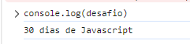

---

2.Imprimir uma string no console do browser usando console.log().

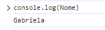

---

3.Imprimir o __length__ da string no console do browser usando o __console.log()__.

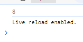

---

4.Troque todos os caracteres da string para letras maiúsculas usando o método __toUpperCase()__.

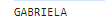

---

5.Troque todos os caracteres da string para letras minúsculas usando o método __toLowerCase()__.


---

6.Retirar (Slice) a primeira letra da string usando os métodos __substr()__ ou __substring()__. 

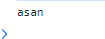

---

7.Dividir a frase *Days Of JavaScript* de *30 Days Of JavaScript*.

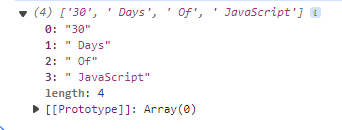

---

8.Verificar se a string contém a palavra __Script__ usando o método __includes()__.

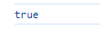

---

9.Separar a __string__ em um __array__ usando o método __split()__.

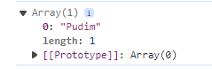

---

10.Separar a string 30 Dias de JavaScript com espaços usando o método __split()__.

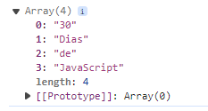

---

11."Facebook, Google, Microsoft, Apple, IBM, Oracle, Amazon" __split__ a string com vírgulas e mude-a para um array. 

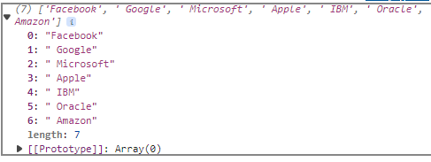

---

12.Mude 30 Dias de JavaScript para 30 Dias de Python usando o método __replace()__.

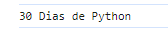

---

13.Qual é o caractere no index 15 em "30 Dias de JavaScript' string? Use o método __charAt()__.

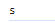

---

14.Qual é o código do caractere de J em "30 Dias de JavaScript" string usando o método __charCodeAt()__.

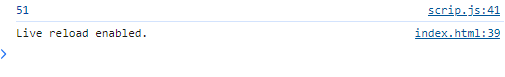

---

15.Use __indexOf__ para determinar a posição da primeira ocorrência de __a__ em 30 Dias de JavaScript.

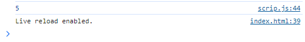

---

16.Use __lastIndexOf__ para determinar a posição da última ocorrência de __a__ em 30 Dias de JavaScript.

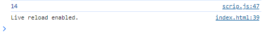

---

17.Use __indexOf__ para encontrar a posição da primeira ocorrência da palavra __because__ na seguinte frase:__'You cannot end a sentence with because because because is a conjunction'__.

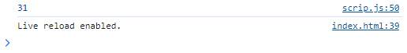

---

18.Use __lastIndexOf__ para encontrar a posição da última ocorrência da palavra __because__ na seguinte frase:__'You cannot end a sentence with because because because is a conjunction'__.

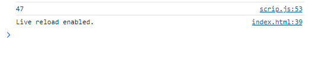

---

19.Use __search__ para encontrar a posição da primeira ocorrência da palavra __because__ na seguinte frase:__'You cannot end a sentence with because because because is a conjunction'__.

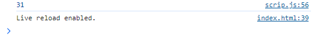

---

20.Use __trim()__ para remover qualquer espaço adicional no início e no final da string .E.g "   30 Dias de JavaScript   ".

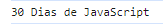

---

21.Use __startsWith()__ com a string *30 Dias De JavaScript* e faça o resultado ser verdadeiro.

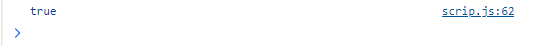

---

22.Use __endsWith()__ com a string *30 Dias De JavaScript* e faça o resultado ser verdadeiro.

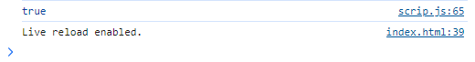

---

23.Use __match()__ para encontrar todos os __a__'s em 30 Dias De JavaScript.

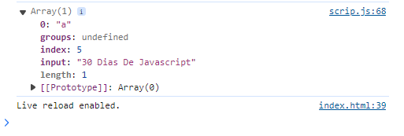

---

24.Use __concat()__ para unir "30 Dias de" e "JavaScript" para uma única string, "30 Dias de JavaScript".

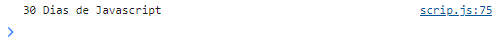

---

25.Use __repeat()__ para imprimir 30 Dias De JavaScript 2 vezes.

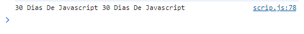

---

Exercícios: Level 2

1. Usando o console.log() imprimir a seguinte citação:
  ```sh
    "Não há exercício melhor para o coração que ir lá em baixo e levantar as pessoas" by John Holmes nos ensina a ajudar outras pessoas.
  ```

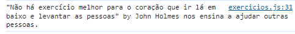

2. Usando o console.log() imprimir a seguinte citação de Madre Teresa:
  ```sh
    "O amor não é paternalista e a caridade não tem a ver com pena, tem a ver com amor. Caridade e amor são a mesma coisa – com a caridade você dá amor, então não dê apenas dinheiro, mas estenda sua mão."
  ```

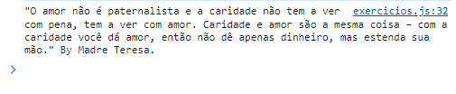

3. Verificar se typeOf "10" é exatamente igual a 10. Se não, faça ser exatamente igual.

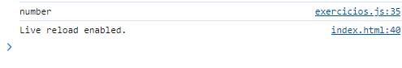

4. Verificar se parseFloat("9.8) é igual a 10. Se não, faça ser exatamente igual com 10.

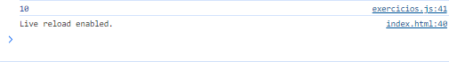

5. Verificar se "ão" é encontrado em ambos algodão e jargão.

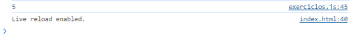

6. _Espero que este curso não tenha muitos jargões_. Verifique se _jargões_ está na frase. 


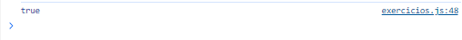

7. Gerar um número aleatório entre incluindo 0 e 100.

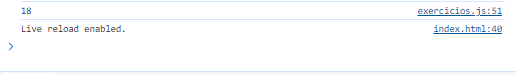

8. Gerar um número aleatório entre incluindo 50 e 100.

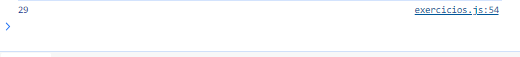

9. Gerar um número aleatório entre incluindo 0 e 255.

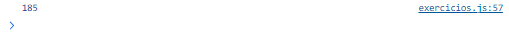

10. Acesse os caracteres da string "JavaScript" usando um número aleatório.

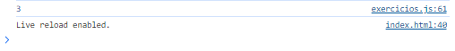

11. Use console.log() e imprimir os caracteres no seguinte padrão.
    ```js
    1 1 1 1 1
    2 1 2 4 8
    3 1 3 9 27
    4 1 4 16 64
    5 1 5 25 125
    ```
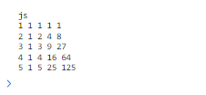

12. Use __substr__ para retirar da frase __because because because__ da seguinte frase: __'You cannot end a sentence with because because because is a conjunction'__.

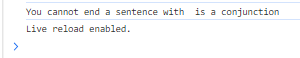

---

Exercícios: Level 3

1. "Amor é a melhor coisa neste mundo. Alguns encontraram seu amor e alguns ainda estão procurando pelo seu amor." Contar o número de palavras __amor__ nesta frase.

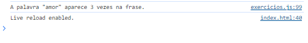

2. Use __match()__ para contar os números de todos os __because__ na seguinte frase: __'You cannot end a sentence with because because because is a conjunction'__.  


3. Limpar o seguinte texto e encontrar a palavra mais repetida (dica, use replace e expressões regulares)
  ```js
    const frase = " %I $am@% a %tea@cher%, &and& I lo%#ve %te@a@ching%;. The@re $is no@th@ing; &as& mo@re rewarding as educa@ting &and& @emp%o@weri@ng peo@ple. ;I found tea@ching m%o@re interesting tha@n any ot#her %jo@bs. %Do@es thi%s mo@tiv#ate yo@u to be a tea@cher!? %Th#is 30#Days&OfJavaScript &is al@so $the $resu@lt of &love& of tea&ching "
  ```  

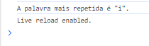

4. Calcular o total anual de uma pessoa extraindo os números do seguinte texto. __"Ele recebe 5000 euros de salário por mês, 10000 euros de bônus anual, 15000 euros de cursos onlines por mês.'__. 

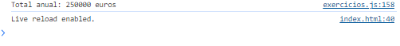.

---