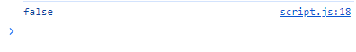
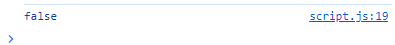
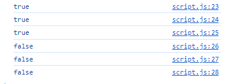

## 💻 Dia 3: Exercícios

### Exercícios: Nível 1

1. Declare as variáveis firstName, lastName, country, city, age, isMarried e year e atribua valores a elas. Use o operador typeof para verificar os diferentes tipos de dados.

## Resultados no devtools


---

2. Verifique se o tipo de `'10'` é igual a 10.

## Resultados no devtools



---

3. Verifique se `parseInt('9.8')` é igual a 10.

## Resultados no devtools



---

4. O valor Booleano é verdadeiro (true) ou falso (false).
   1. Escreva três declarações em JavaScript que forneçam valores verdadeiros (truthy).
   2. Escreva três declarações em JavaScript que forneçam valores falsos (falsy).

## Resultados no devtools



---   

5. Descubra o resultado da seguinte expressão de comparação primeiro sem usar console.log(). Depois de decidir o resultado, confirme-o usando console.log().
   1. 4 > 3
   2. 4 >= 3
   3. 4 < 3
   4. 4 <= 3
   5. 4 == 4
   6. 4 === 4
   7. 4 != 4
   8. 4 !== 4
   9. 4 != '4'
   10. 4 == '4'
   11. 4 === '4'
   12. Encontre o comprimento das palavras "python" e "jargon" e faça uma comparação falsa.

   ## Resultados no devtools

   

6. Descubra o resultado das seguintes expressões primeiro sem usar console.log(). Depois de decidir o resultado, confirme-o usando console.log().
   1. 4 > 3 && 10 < 12
   2. 4 > 3 && 10 > 12
   3. 4 > 3 || 10 < 12
   4. 4 > 3 || 10 > 12
   5. !(4 > 3)
   6. !(4 < 3)
   7. !(false)
   8. !(4 > 3 && 10 < 12)
   9. !(4 > 3 && 10 > 12)
   10. !(4 === '4')
   11. Não há 'on' em ambas as palavras dragon e python.

7. Use o objeto Date para realizar as seguintes atividades:
   1. Qual é o ano atual?
   2. Qual é o mês atual como número?
   3. Qual é a data de hoje?
   4. Qual é o dia da semana hoje como número?
   5. Que horas são agora?
   6. Quantos minutos são agora?
   7. Descubra o número de segundos desde 1º de janeiro de 1970 até agora.

### Exercícios: Nível 2

1. Escreva um script que peça ao usuário para inserir a base e a altura de um triângulo e calcule a área do triângulo (área = 0.5 x b x h).

   ```sh
   Insira a base: 20
   Insira a altura: 10
   A área do triângulo é 100
   ```

2. Escreva um script que peça ao usuário para inserir os lados a, b e c de um triângulo e calcule o perímetro do triângulo (perímetro = a + b + c).

   ```sh
   Insira o lado a: 5
   Insira o lado b: 4
   Insira o lado c: 3
   O perímetro do triângulo é 12
   ```

3. Obtenha o comprimento e a largura usando prompt e calcule a área de um retângulo (área = comprimento x largura) e o perímetro do retângulo (perímetro = 2 x (comprimento + largura)).

4. Obtenha o raio usando prompt e calcule a área de um círculo (área = pi x r x r) e a circunferência de um círculo (c = 2 x pi x r), onde pi = 3.14.

5. Calcule a inclinação, o intercepto x e o intercepto y da equação y = 2x - 2.

6. A inclinação é m = (y₂ - y₁) / (x₂ - x₁). Encontre a inclinação entre o ponto (2, 2) e o ponto (6, 10).

7. Compare a inclinação das duas questões acima.

8. Calcule o valor de y (y = x² + 6x + 9). Tente usar diferentes valores de x e descubra para qual valor de x y é igual a 0.

9. Escreva um script que solicite ao usuário que insira horas e a taxa por hora. Calcule o pagamento da pessoa.

   ```sh
   Insira as horas: 40
   Insira a taxa por hora: 28
   Seu ganho semanal é 1120
   ```

10. Se o comprimento do seu nome for maior que 7, diga que seu nome é longo, caso contrário, diga que seu nome é curto.

11. Compare o comprimento do seu primeiro nome e do seu sobrenome e você deve obter a seguinte saída:

    ```js
    let firstName = 'Asabeneh'
    let lastName = 'Yetayeh'
    ```

    ```sh
    Seu primeiro nome, Asabeneh, é mais longo que seu sobrenome, Yetayeh.
    ```

12. Declare duas variáveis, _myAge_ e _yourAge_, e atribua a elas valores iniciais e myAge e yourAge.

    ```js
    let myAge = 250
    let yourAge = 25
    ```

    ```sh
    Eu sou 225 anos mais velho que você.
    ```

13. Usando prompt, obtenha o ano de nascimento do usuário e, se o usuário tiver 18 anos ou mais, permita que ele dirija; caso contrário, diga ao usuário para esperar uma certa quantidade de anos.

    ```sh
    Insira o ano de nascimento: 1995
    Você tem 25 anos. Você é velho o suficiente para dirigir.

    Insira o ano de nascimento: 2005
    Você tem 15 anos. Você poderá dirigir depois de 3 anos.
    ```

14. Escreva um script que peça ao usuário para inserir o número de anos. Calcule o número de segundos que uma pessoa pode viver, assumindo que alguém vive apenas cem anos.

    ```sh
    Insira o número de anos que você vive: 100
    Você viveu 3153600000 segundos.
    ```

15. Crie um formato de hora legível usando o objeto Date:
   1. YYYY-MM-DD HH:mm
   2. DD-MM-YYYY HH:mm
   3. DD/MM/YYYY HH:mm

### Exercícios: Nível 3

1. Crie um formato de hora legível usando o objeto Date. A hora e o minuto devem ter sempre dois dígitos (7 horas devem ser 07 e 5 minutos devem ser 05):
   1. YYYY-MM-DD HH:mm, ex. 20120-01-02 07:05

