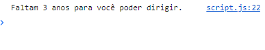
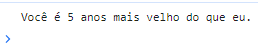
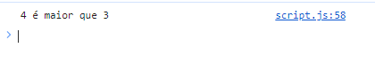
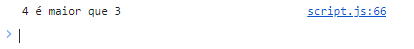
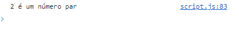
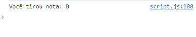
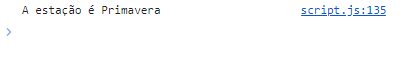
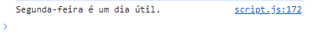

# 💻 Dia 4: Exercícios

### Exercícios: Nível 1

1. Obtenha a entrada do usuário usando prompt("Digite sua idade:"). Se o usuário tiver 18 anos ou mais, forneça o feedback: "Você é maior de idade para dirigir". Caso contrário, forneça outro feedback informando quantos anos faltam para ele completar 18 anos.

```sh
Copy code
Digite sua idade: 30
Você é maior de idade para dirigir.

Digite sua idade: 15
Faltam 3 anos para você poder dirigir.
```

## Resultados no devtools



---

2. Compare os valores de minhaIdade e suaIdade usando if … else. Com base na comparação, registre o resultado no console indicando quem é mais velho (eu ou você). Use prompt("Digite sua idade:") para obter a idade como entrada.

```sh
Copy code
Digite sua idade: 30
Você é 5 anos mais velho do que eu.
```

## Resultados no devtools

 
## Resultados no devtools

---

3. Se a for maior que b, retorne 'a é maior que b', caso contrário, 'a é menor que b'. Tente implementar de duas maneiras:

- Usando if else
- Usando operador ternário

```js
Copy code
  let a = 4
  let b = 3
```

```sh
Copy code
  4 é maior que 3
```
<
## Resultados no devtools
 
 ### - Usando if else
 

 ### - Usando operador ternário
 

---

4. Números pares são divisíveis por 2 e o resto é zero. Como você verifica se um número é par ou ímpar usando JavaScript?


```sh
Copy code
Digite um número: 2
2 é um número par

Digite um número: 9
9 é um número ímpar.
```

## Resultados no devtools
 
 

---

### Exercícios: Nível 2
1. Escreva um código que atribua notas aos alunos de acordo com suas pontuações:

- 80-100: A
- 70-89: B
- 60-69: C
- 50-59: D
- 0-49: F

## Resultados no devtools
 
 

---

2. Verifique se a estação do ano é Outono, Inverno, Primavera ou Verão. Se a entrada do usuário for:

- Setembro, Outubro ou Novembro, a estação é Outono.
- Dezembro, Janeiro ou Fevereiro, a estação é Inverno.
- Março, Abril ou Maio, a estação é Primavera.
- Junho, Julho ou Agosto, a estação é Verão.

## Resultados no devtools
 
 

---

3. Verifique se um dia é fim de semana ou um dia útil. Seu script deve receber o dia como entrada.

```sh
Copy code
    Qual é o dia hoje? Sábado
    Sábado é um fim de semana.

    Qual é o dia hoje? sabado
    Sábado é um fim de semana.

    Qual é o dia hoje? Sexta-feira
    Sexta-feira é um dia útil.

    Qual é o dia hoje? seXta-feIRa
    Sexta-feira é um dia útil.
```
## Resultados no devtools
 
 

---

### Exercícios: Nível 3

1. Escreva um programa que informe o número de dias em um mês.

```sh
Copy code
  Digite um mês: Janeiro
  Janeiro tem 31 dias.

  Digite um mês: JANEIRO
  Janeiro tem 31 dias.

  Digite um mês: Fevereiro
  Fevereiro tem 28 dias.

  Digite um mês: feVereiro
  Fevereiro tem 28 dias.
```  
2. Escreva um programa que informe o número de dias em um mês, considerando anos bissextos.