## 💻 Dia 5: Exercícios

### Exercício: Nível 1

1. Declare um _array vazio_;

## Resultados no devtools


---

2. Declare um array com mais de 5 elementos;

## Resultados no devtools

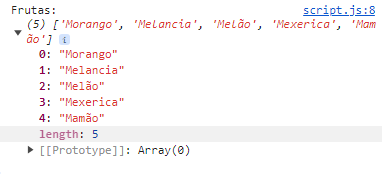

---

3. Encontre o comprimento do seu array;

## Resultados no devtools

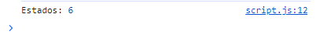

---

4. Obtenha o primeiro item, o item do meio e o último item do array;

## Resultados no devtools

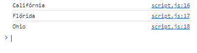

---

5. Declare um array chamado _mixedDataTypes_, coloque diferentes tipos de dados no array e encontre o comprimento do array. O tamanho do array deve ser maior que 5;

## Resultados no devtools

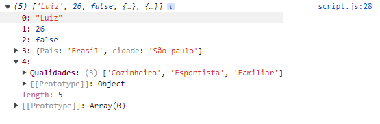

---

6. Declare uma variável de array chamada itCompanies e atribua os valores iniciais Facebook, Google, Microsoft, Apple, IBM, Oracle e Amazon;

## Resultados no devtools

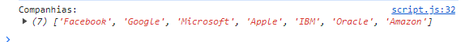

---

7. Imprima o array usando _console.log()_;
 
## Resultados no devtools


---

8. Imprima o número de empresas no array;

## Resultados no devtools

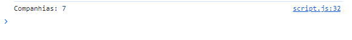

---

9. Imprima a primeira empresa, a do meio e a última empresa;

## Resultados no devtools

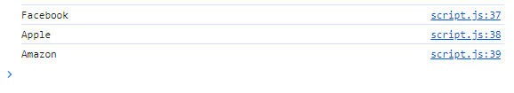

---

10. Imprima cada empresa;

## Resultados no devtools

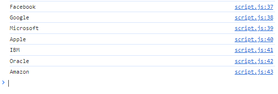

---
11. Altere o nome de cada empresa para maiúsculas uma por uma e imprima-os;

## Resultados no devtools

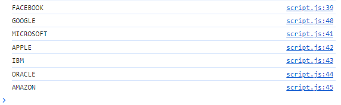

---

12. Imprima o array como uma frase: Facebook, Google, Microsoft, Apple, IBM, Oracle e Amazon são grandes empresas de TI;

## Resultados no devtools

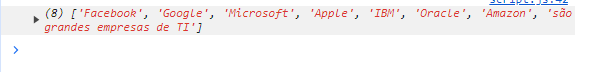

---

13. Verifique se uma certa empresa existe no array itCompanies. Se existir, retorne a empresa; caso contrário, retorne que a empresa _não foi encontrada_;

## Resultados no devtools

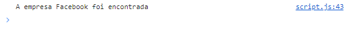

---

14. Filtre empresas que tenham mais de uma letra 'o' sem usar o método filter;

## Resultados no devtools

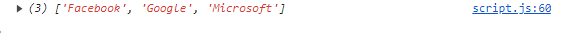

---

15. Ordene o array usando o método _sort()_;

## Resultados no devtools

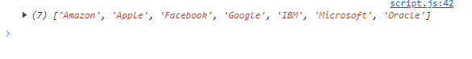

---

16. Inverta o array usando o método _reverse()_;

## Resultados no devtools

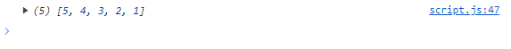

---

17. Extraia as primeiras 3 empresas do array;

## Resultados no devtools

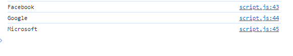

---

18. Extraia as últimas 3 empresas do array;

## Resultados no devtools

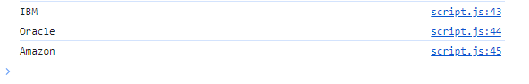
---

19. Extraia a(s) empresa(s) de TI do meio do array;

## Resultados no devtools

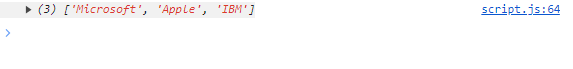

---

20. Remova a primeira empresa de TI do array;

## Resultados no devtools

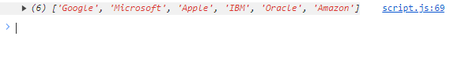

---

21. Remova a(s) empresa(s) de TI do meio do array;

## Resultados no devtools

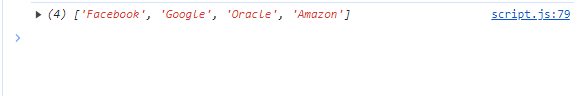

---

22. Remova a última empresa de TI do array;

## Resultados no devtools

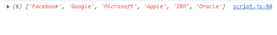

---

23. Remova todas as empresas de TI;

## Resultados no devtools

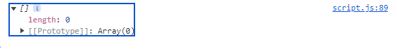

---

### Exercício: Nível 2

1. Crie um arquivo separado countries.js e armazene o array countries neste arquivo. Crie um arquivo separado web_techs.js e armazene o array webTechs neste arquivo. Acesse ambos os arquivos no arquivo main.js;

```js
const countries = [
  'Albânia',
  'Bolívia',
  'Canadá',
  'Dinamarca',
  'Etiópia',
  'Finlândia',
  'Alemanha',
  'Hungria',
  'Irlanda',
  'Japão',
  'Quênia'
]

const webTechs = [
  'HTML',
  'CSS',
  'JavaScript',
  'React',
  'Redux',
  'Node',
  'MongoDB'
]
```

## Resultados no devtools

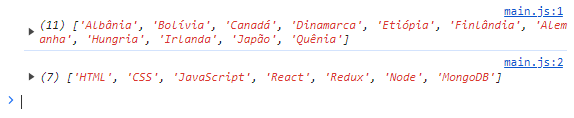

---

2. Primeiro remova toda a pontuação e converta a string em um array e conte o número de palavras no array:

    ```js
    let text =
    'Eu amo ensinar e empoderar pessoas. Eu ensino HTML, CSS, JS, React, Python.'
    console.log(words)
    console.log(words.length)
    ```

    ```sh
    ["Eu", "amo", "ensinar", "e", "empoderar", "pessoas", "Eu", "ensino", "HTML", "CSS", "JS", "React", "Python"]
  
    13
    ```

## Resultados no devtools

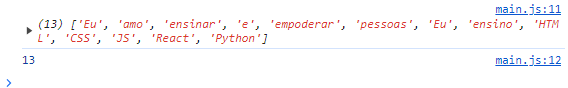

---

3. No carrinho de compras, adicione, remova e edite itens:

    ```js
    const shoppingCart = ['Leite', 'Café', 'Chá', 'Mel']
    ```

   - Adicione 'Carne' no início do seu carrinho de compras se ainda não tiver sido adicionado;
   - Adicione Açúcar no final do seu carrinho de compras se ainda não tiver sido adicionado;
   - Remova 'Mel' se você for alérgico ao mel;
   - Modifique Chá para 'Chá Verde';

## Resultados no devtools

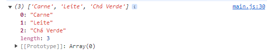

---   

4. No array countries, verifique se 'Etiópia' existe no array; se existir, imprima 'ETIÓPIA'. Se não existir, adicione à lista de países;


## Resultados no devtools


---


5. No array webTechs, verifique se Sass existe no array e, se existir, imprima 'Sass é um pré-processador CSS'. Se não existir, adicione Sass ao array e imprima o array;

## Resultados no devtools

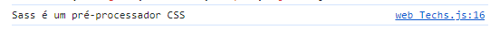

---

6. Concatene as seguintes duas variáveis e armazene na variável fullStack:

    ```js
    const frontEnd = ['HTML', 'CSS', 'JS', 'React', 'Redux']
    const backEnd = ['Node', 'Express', 'MongoDB']
  
    console.log(fullStack)
    ```

    ```sh
    ["HTML", "CSS", "JS", "React", "Redux", "Node", "Express", "MongoDB"]
    ```

  ## Resultados no devtools

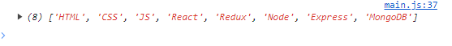

---

### Exercício: Nível 3

1. O seguinte é um array com as idades de 10 alunos:

    ```js
    const ages = [19, 22, 19, 24, 20, 25, 26, 24, 25, 24]
    ```

    - Ordene o array e encontre a idade mínima e máxima;

     ## Resultados no devtools

    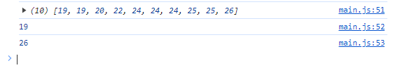

    - Encontre a idade mediana (um item do meio ou dois itens do meio divididos por dois);
    - Encontre a idade média (todos os itens divididos pelo número de itens);
    - Encontre a faixa etária (máxima menos mínima);
    - Compare o valor de (mínimo - média) e (máximo - média), use o método _abs()_;

    ## Resultados no devtools

    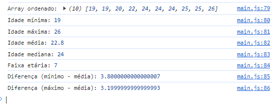

  ---

2. Extraia os primeiros dez países do array [countries array](https://github.com/Asabeneh/30DaysOfJavaScript/tree/master/data/countries.js);

  ## Resultados no devtools

    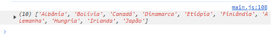

---

3. Encontre o(s) país(es) do meio no [array countries](https://github.com/Asabeneh/30DaysOfJavaScript/tree/master/data/countries.js);

 ## Resultados no devtools

    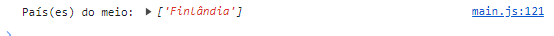

---

4. Divida o array de países em dois arrays iguais, se for par. Se o array de países não for par, coloque um país a mais na primeira metade.

## Resultados no devtools

    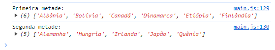

---
