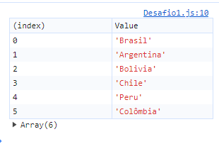
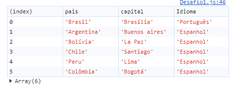
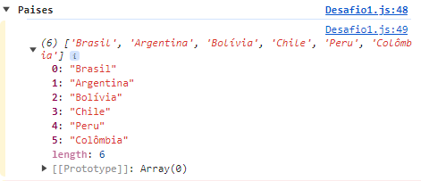
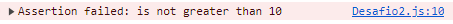
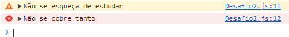

## Exercícios

### Exercícios: Nível 1

1. Exibir o array de países como uma tabela

2. Exibir o objeto de países como uma tabela

3. Usar console.group() para agrupar logs

### Exercícios: Nível 2

1. 10 > 2 * 10 usar console.assert()

2. Escrever uma mensagem de aviso usando console.warn()
3. Escrever uma mensagem de erro usando console.error()

### Exercícios: Nível 3

1. Verificar a diferença de velocidade entre os seguintes loops: while, for, for of, forEach