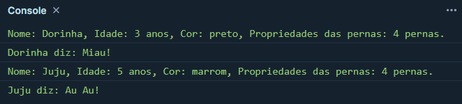
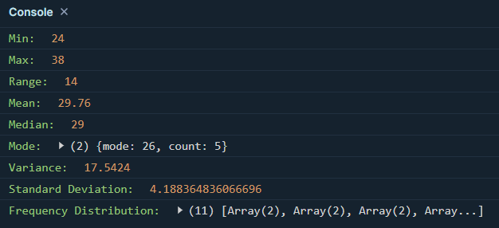

Claro! Aqui está a tradução do seu `readme.md`:

## Exercícios

### Exercícios Nível 1

1. Crie uma classe Animal. A classe terá propriedades nome, idade, cor e pernas, e métodos diferentes.
2. Crie classes filhas Cachorro e Gato a partir da classe Animal.

### Exercícios Nível 2

1. Sobrescreva o método que você criou na classe Animal.

## Exercicios Nivel 1 e 2



### Exercícios Nível 3

1. Vamos tentar desenvolver um programa que calcule medidas de tendência central de uma amostra (média, mediana, moda) e medidas de variabilidade (intervalo, variância, desvio padrão). Além dessas medidas, encontre o mínimo, máximo, contagem, percentil e distribuição de frequência da amostra. Você pode criar uma classe chamada Estatísticas e implementar todas as funções que realizam cálculos estatísticos como métodos dessa classe. Confira a saída abaixo.

```JS
idades = [31, 26, 34, 37, 27, 26, 32, 32, 26, 27, 27, 24, 32, 33, 27, 25, 26, 38, 37, 31, 34, 24, 33, 29, 26]

console.log('Contagem:', estatisticas.count()) // 25
console.log('Soma: ', estatisticas.sum()) // 744
console.log('Mínimo: ', estatisticas.min()) // 24
console.log('Máximo: ', estatisticas.max()) // 38
console.log('Intervalo: ', estatisticas.range()) // 14
console.log('Média: ', estatisticas.mean()) // 30
console.log('Mediana: ', estatisticas.median()) // 29
console.log('Moda: ', estatisticas.mode()) // {'moda': 26, 'contagem': 5}
console.log('Variância: ', estatisticas.var()) // 17.5
console.log('Desvio Padrão: ', estatisticas.std()) // 4.2
console.log('Distribuição de Frequência: ', estatisticas.freqDist()) // [(20.0, 26), (16.0, 27), (12.0, 32), (8.0, 37), (8.0, 34), (8.0, 33), (8.0, 31), (8.0, 24), (4.0, 38), (4.0, 29), (4.0, 25)]
```

```sh
// sua saída deve parecer com isto
console.log(estatisticas.describe())
Contagem: 25
Soma:  744
Mínimo:  24
Máximo:  38
Intervalo:  14
Média:  30
Mediana:  29
Moda:  (26, 5)
Variância:  17.5
Desvio Padrão:  4.2
Distribuição de Frequência: [(20.0, 26), (16.0, 27), (12.0, 32), (8.0, 37), (8.0, 34), (8.0, 33), (8.0, 31), (8.0, 24), (4.0, 38), (4.0, 29), (4.0, 25)]
```



2. Crie uma classe chamada ContaPessoal. Ela terá as propriedades nome, sobrenome, rendimentos, despesas e os métodos totalRenda, totalDespesa, infoConta, adicionarRenda, adicionarDespesa e saldoConta. Rendas será um conjunto de rendimentos e suas descrições, e despesas também será um conjunto de despesas e suas descrições.