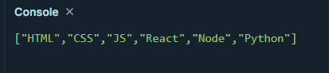
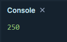
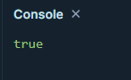
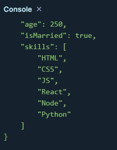
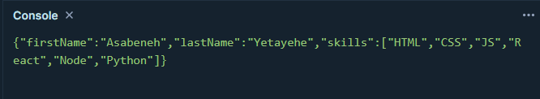
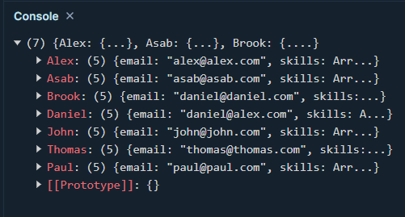
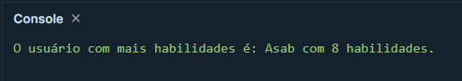

### Exercícios Nível 1

1. Converta o array de habilidades para JSON usando JSON.stringify()

2. Converta a variável idade para JSON

3. Converta a variável isMarried para JSON

4. Converta o objeto estudante para JSON

### Exercícios Nível 2

1. Converta o objeto estudantes para JSON, incluindo apenas as propriedades firstName, lastName e skills

### Exercícios Nível 3

1. Converta o JSON *txt* para objeto.

2. Encontre o usuário que possui mais habilidades a partir da variável armazenada em *txt*.

