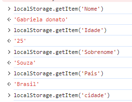

## Exercícios

### Exercícios: Nível 1

1. Armazene seu primeiro nome, sobrenome, idade, país e cidade no localStorage do seu navegador.

### Exercícios: Nível 2

1. Crie um objeto estudante. O objeto estudante terá as chaves e valores de primeiro nome, sobrenome, idade, habilidades, país e matrícula. Armazene o objeto estudante no localStorage do seu navegador.

### Exercícios: Nível 3

1. Crie um objeto chamado personAccount. Ele terá as propriedades primeiro nome, sobrenome, rendimentos, despesas e métodos para totalIncome, totalExpense, accountInfo, addIncome, addExpense e accountBalance. Rendimentos é um conjunto de rendimentos e suas descrições, e despesas também é um conjunto de despesas e suas descrições.