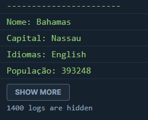
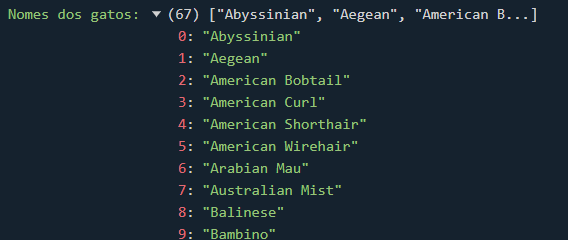

## Exercícios

```js
const countriesAPI = 'https://restcountries.com/v2/all'
const catsAPI = 'https://api.thecatapi.com/v1/breeds'
```

### Exercícios: Nível 1

1. Leia a API de países usando fetch e imprima o nome do país, capital, idiomas, população e área.



### Exercícios: Nível 2

1. Imprima todos os nomes de gatos na variável catNames.



### Exercícios: Nível 3

1. Leia a API de gatos e encontre o peso médio dos gatos em unidades métricas.
2. Leia a API de países e descubra os 10 maiores países.
3. Leia a API de países e conte o número total de idiomas no mundo usados como oficiais.