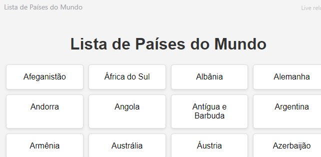

## Exercícios

### Exercícios: Nível 1

1. Crie um contêiner `
` no documento HTML e gere números de 1 a 100 dinamicamente, adicionando-os ao contêiner `
`.
   - Fundo dos números pares: verde
   - Fundo dos números ímpares: amarelo
   - Fundo dos números primos: vermelho

  

### Exercícios: Nível 2

1. Use o array de países para exibir todos os países. Veja o design.

### Exercícios: Nível 3

Verifique os requisitos deste projeto a partir das duas imagens (jpg e gif). Todos os dados e CSS foram implementados usando apenas JavaScript. Os dados estão na pasta inicial do projeto 3. O botão de dropdown foi criado usando o elemento HTML [*details*](https://www.w3schools.com/tags/tag_details.asp).

