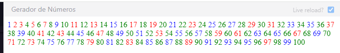

## Exercícios

### Exercício: Nível 1

1. Gerando números e marcando pares, ímpares e números primos com três cores diferentes. Veja a imagem abaixo.

2. Gerando o código da tecla do teclado usando o ouvinte de eventos. Veja a imagem abaixo.

